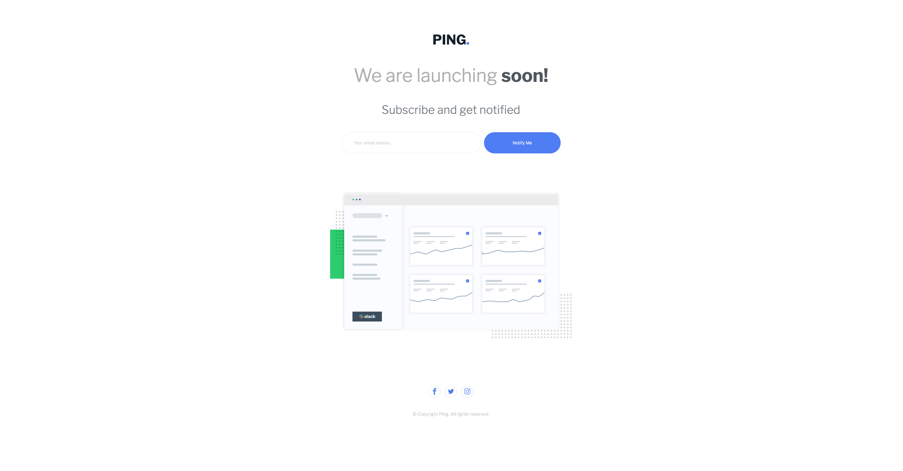

# Frontend Mentor - Ping coming soon page solution

This is my solution to the [Ping coming soon page challenge on Frontend Mentor](https://www.frontendmentor.io/challenges/ping-single-column-coming-soon-page-5cadd051fec04111f7b848da). Frontend Mentor challenges help you improve your coding skills by building realistic projects.

## Table of contents

- [Overview](#overview)
  - [The challenge](#the-challenge)
  - [Screenshot](#screenshot)
  - [Links](#links)
- [My process](#my-process)
  - [Built with](#built-with)
  - [What I learned](#what-i-learned)
  - [Continued development](#continued-development)
  - [Useful resources](#useful-resources)
- [Author](#author)
- [Acknowledgments](#acknowledgments)

## Overview

### The challenge

Users should be able to:

- View the optimal layout for the site depending on their device's screen size
- See hover states for all interactive elements on the page
- Submit their email address using an `input` field
- Receive an error message when the `form` is submitted if:
	- The `input` field is empty. The message for this error should say *"Whoops! It looks like you forgot to add your email"*
	- The email address is not formatted correctly (i.e. a correct email address should have this structure: `name@host.tld`). The message for this error should say *"Please provide a valid email address"*

### Screenshot

### Links

- Solution URL: [GitHub](https://github.com/Drallas/Ping-Coming-Soon)
- Live Site URL: [GitHub Pages](https://drallas.github.io/Ping-Coming-Soon/)

## My process
This site is built with a Mobile First approach, using **VSCode** and **Adobe XD** to look at the provided design templates.

### Built with

- Semantic HTML5 markup
- CSS custom properties
- Flexbox
- BEM (at least tried)
- Vanilla JavaScript (75% Stitched together pieces from the Web)

### What I learned

It's harder than i thought to build a responsive website from even a 'simple' Frontendmentor.io design, its also more time-consuming to make it all look and feel like as specified. 

### Continued development

I have watched too much tutorials and occasionally i have built small web projects  / components for fun. To really improve my skills i need to start building Frontendmentor.io challenges on almost al daily bases. Tutorials make the time pass by slow, when building something i completely forget about the time.

HTML feels simple, but CSS is much harder than i thought, there are so many options and different ways to do the same thing. What i lack is consistent experience build Web Project especially with CSS and JavaScript is still struggle. 

### Useful resources

- [Build 20 mini frontend projects from scratch with HTML5, CSS & JavaScript](https://www.udemy.com/course/web-projects-with-vanilla-javascript/) - Helped me to get the email error validation to work.
- [Ecosia](www.ecosia.org) - I used mostly Ecosia search to figure out more when i was stuck.

## Author

- Frontend Mentor - [@Drallas](https://www.frontendmentor.io/profile/Drallas)
- Dev.to - [@Drallas](https://dev.to/drallas)

## Acknowledgments

This is where you can give a hat tip to anyone who helped you out on this project. Perhaps you worked in a team or got some inspiration from someone else's solution. This is the perfect place to give them some credit.

